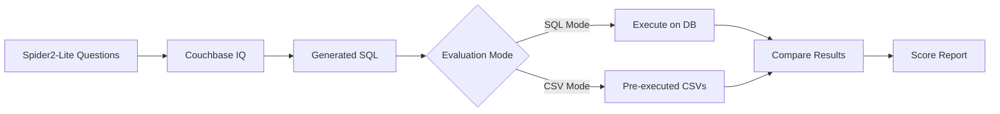

# Setup Guide for Spider2-Lite + Couchbase IQ Evaluation

## 🔧 Installation & Setup

### Step 1: Install Python Dependencies

```bash
cd /Users/soham.sarkar/Documents/evaluations/Spider2/spider2-lite/evaluation_suite

# Option A: Using pip (may require virtual environment on macOS)
python3 -m venv venv
source venv/bin/activate
pip install pandas tqdm

# Option B: Using system Python with --break-system-packages (not recommended)
pip install pandas tqdm --break-system-packages

# Option C: Using conda (if you have it)
conda install pandas tqdm
```

### Step 2: Set Up Database Access (Optional for SQL Mode)

#### For SQLite (Local) - Free
```bash
# Download SQLite databases
wget https://drive.usercontent.google.com/download?id=1coEVsCZq-Xvj9p2TnhBFoFTsY-UoYGmG -O spider2-localdb.zip
unzip spider2-localdb.zip -d ../resource/databases/spider2-localdb/
```

#### For BigQuery - Requires GCP Account (Costs Money)
```bash
# 1. Create GCP project
# 2. Enable BigQuery API
# 3. Create service account
# 4. Download credentials JSON
# 5. Save as bigquery_credential.json

pip install google-cloud-bigquery
```

Example `bigquery_credential.json`:
```json
{
  "type": "service_account",
  "project_id": "your-project-id",
  "private_key_id": "...",
  "private_key": "...",
  "client_email": "...",
  "client_id": "...",
  "auth_uri": "https://accounts.google.com/o/oauth2/auth",
  "token_uri": "https://oauth2.googleapis.com/token"
}
```

#### For Snowflake - Requires Account Request
```bash
# 1. Fill form: https://docs.google.com/forms/d/e/1FAIpQLScbVIYcBkADVr-NcYm9fLMhlxR7zBAzg-jaew1VNRj6B8yD3Q/viewform
# 2. Wait for account email
# 3. Create snowflake_credential.json

pip install snowflake-connector-python
```

Example `snowflake_credential.json`:
```json
{
  "user": "your_username",
  "password": "your_password",
  "account": "account_identifier",
  "warehouse": "warehouse_name",
  "role": "role_name"
}
```

### Step 3: Verify Installation

```bash
python3 -c "import pandas; print('✓ pandas installed')"
python3 -c "import tqdm; print('✓ tqdm installed')"
```

## 🧪 Quick Test (No Database Required!)

```bash
# Generate synthetic test data
python3 create_synthetic_test_data.py

# Test evaluation with CSV mode (no database needed)
python3 evaluate.py --result_dir test_submission_csv_perfect --mode exec_result

# Expected output:
# Final score: 1.0, Correct examples: 4, Total examples: 4
# (100% accuracy - perfect match!)

# Test with wrong data
python3 evaluate.py --result_dir test_submission_csv_wrong --mode exec_result

# Expected output:
# Final score: 0.0, Correct examples: 0, Total examples: 4
# (0% accuracy - all wrong!)
```

## 📝 Evaluation Workflow



## 🎯 Three Evaluation Approaches

### Approach 1: CSV Mode (Recommended for Development)
**No database access needed!**

```bash
# 1. Generate SQL with Couchbase IQ
python3 couchbase_iq_integration_template.py

# 2. Execute SQL separately (your own environment)
# Save results as CSV files

# 3. Evaluate
python3 evaluate.py --result_dir couchbase_iq_results --mode exec_result
```

**Pros**: Free, fast, no DB setup
**Cons**: Manual SQL execution needed

### Approach 2: SQL Mode (Local Only)
**Only SQLite databases**

```bash
# 1. Download SQLite databases (see Step 2 above)

# 2. Generate SQL with Couchbase IQ
python3 couchbase_iq_integration_template.py

# 3. Evaluate (only local* instances)
python3 evaluate.py --result_dir couchbase_iq_results --mode sql
```

**Pros**: Free, automatic execution
**Cons**: Only ~100 SQLite instances (not full benchmark)

### Approach 3: SQL Mode (Full Benchmark)
**All databases: BigQuery + Snowflake + SQLite**

```bash
# 1. Set up all databases (see Step 2 above)

# 2. Generate SQL with Couchbase IQ
python3 couchbase_iq_integration_template.py

# 3. Evaluate all 547 instances
python3 evaluate.py --result_dir couchbase_iq_results --mode sql
```

**Pros**: Full benchmark, automatic execution
**Cons**: Costs money (BigQuery ~$5-50), requires account setup

## 💰 Cost Estimates

| Database | Cost | Notes |
|----------|------|-------|
| SQLite | $0 | Free, local files |
| BigQuery | $5-50 | Depends on queries, ~$0.01-0.10 per query |
| Snowflake | $0* | Free trial or Spider2 test account |

**Tip**: Use CSV mode during development to avoid costs!

## 📦 What You Have Now

```
evaluation_suite/
├── ✅ SETUP.md                              # This file
├── ✅ QUICK_REFERENCE.md                    # Quick lookup
├── ✅ COUCHBASE_IQ_GUIDE.md                # Detailed guide
├── ✅ TEST_DATA_README.md                   # Testing guide
├── ✅ create_synthetic_test_data.py         # Test generator
├── ✅ couchbase_iq_integration_template.py  # Template to customize
├── ✅ test_submission_csv_perfect/          # Synthetic test data
├── ✅ test_submission_csv_wrong/            # Synthetic test data
├── ✅ test_submission_sql_perfect/          # Synthetic test data
├── ✅ test_submission_sql_mixed/            # Synthetic test data
├── 📝 evaluate.py                           # Evaluation script
├── 📝 gold/                                 # Reference data
└── 🔨 couchbase_iq_results/                # Your output goes here
```

## 🚦 Quick Start Checklist

- [ ] 1. Install pandas: `pip install pandas tqdm`
- [ ] 2. Test installation: `python3 -c "import pandas; print('OK')"`
- [ ] 3. Generate test data: `python3 create_synthetic_test_data.py`
- [ ] 4. Run test eval: `python3 evaluate.py --result_dir test_submission_csv_perfect --mode exec_result`
- [ ] 5. See 100% score ✅
- [ ] 6. Customize `couchbase_iq_integration_template.py`
- [ ] 7. Generate SQL with Couchbase IQ
- [ ] 8. Evaluate your results!

## 🐛 Troubleshooting

### "No module named 'pandas'"
```bash
# Create virtual environment first
python3 -m venv venv
source venv/bin/activate
pip install pandas tqdm google-cloud-bigquery snowflake-connector-python
```

### "externally-managed-environment"
Your macOS Python is protected. Use virtual environment:
```bash
python3 -m venv venv
source venv/bin/activate
pip install pandas
```

### "Can't find spider2-lite.jsonl"
```bash
# Make sure you're in the right directory
cd /Users/soham.sarkar/Documents/evaluations/Spider2/spider2-lite/evaluation_suite
ls ../spider2-lite.jsonl  # Should exist
```

### BigQuery authentication errors
```bash
export GOOGLE_APPLICATION_CREDENTIALS="bigquery_credential.json"
# Or set in evaluate.py line 132
```

## 📚 Next Steps

1. **Read** `QUICK_REFERENCE.md` for command cheat sheet
2. **Read** `COUCHBASE_IQ_GUIDE.md` for integration details
3. **Test** with synthetic data (no DB needed)
4. **Customize** `couchbase_iq_integration_template.py`
5. **Run** evaluation!

## 📞 Support

- Spider2 GitHub: https://github.com/xlang-ai/Spider2
- BigQuery Setup: https://github.com/xlang-ai/Spider2/blob/main/assets/Bigquery_Guideline.md
- Snowflake Access: https://docs.google.com/forms/d/e/1FAIpQLScbVIYcBkADVr-NcYm9fLMhlxR7zBAzg-jaew1VNRj6B8yD3Q/viewform

---

**You're ready to evaluate Couchbase IQ on Spider2-Lite! 🚀**

